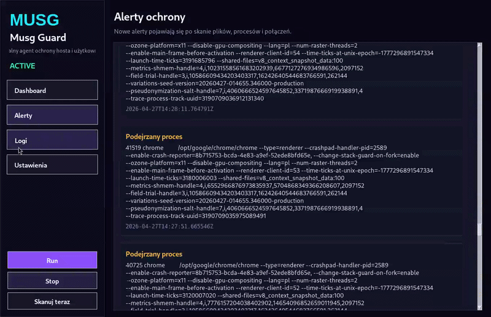

MUSG GUARD COMPLETE
===================

kompletny projekt lokalnego agenta ochrony z GUI w Pythonie.

Uruchomienie:
1. cd ~/musg_guard_complete
2. python3 main.py

Co działa:
- GUI desktopowe w Tkinter.
- Okresowy skan katalogu Downloads.
- Detekcja procesów po słowach kluczowych.
- Detekcja połączeń na wybranych portach.
- Lokalne alerty i live logi.
- Edycja konfiguracji z poziomu aplikacji.
